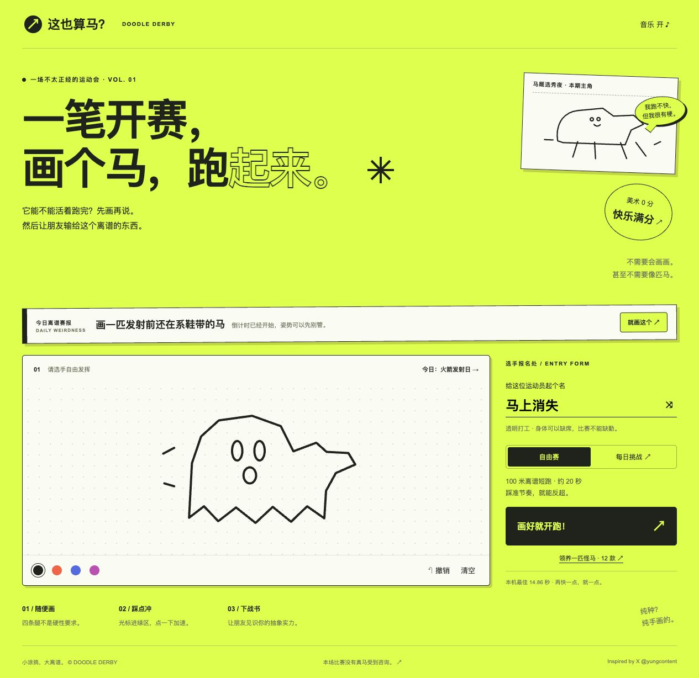

# 这也算马？ / Doodle Derby

> 画得越怪，跑得越帅。
>
> 一款把灵魂线稿变成赛马、把比赛结果变成梗、再把朋友拉进来复仇的中文浏览器小游戏。

<p align="center">
  <a href="https://horse.fde.fan/"></a>
  <a href="https://github.com/tubban1/draw_horse_race"></a>
  <a href="https://horse.fde.fan/#feedbacks"></a>
</p>

<p align="center">
  <a href="https://horse.fde.fan/">打开游戏</a> ·
  <a href="#怎么玩">怎么玩</a> ·
  <a href="#本地运行">本地运行</a> ·
  <a href="#部署">部署</a>
</p>



## 怎么玩

1. **随便画。** 四条腿、马头、重力和审美都不是硬性要求。
2. **踩点跑。** 每 0.8 秒抓一次绿区，连击越稳，马越快。
3. **发战绩。** 海报、二维码和好友配速影子一起生成，朋友打开链接就能复仇。

核心问题只有一个：**你画的这个东西，能不能活着跑完 100 米？**

## 为什么会想分享

- **每个人的马都不一样：** 线稿、名字、颜色、名次和连击会共同生成一条专属战绩梗。
- **AI 物种鉴定：** 赛后看图起外号、写荒诞吐槽和挑战语；模型不可用时自动切到本地备用梗。
- **好友接战：** 分享链接携带手绘马、成绩和赛道种子，朋友挑战的是你的配速影子。
- **每日离谱赛报：** 按日期轮换规则和题目，例如“画一匹发射前还在系鞋带的马”。
- **领养怪马：** 香蕉、拖鞋、拉面、幽灵、火箭……12 款怪马可以领养、改造、再送上赛道。
- **分享友好：** 静态海报带二维码；动态战绩优先生成 MP4，不支持时回退 GIF。

## AI 物种鉴定长什么样

> **疑似梦游的马**<br>
> 这只马在梦里跑，线条也跟着迷路了！<br>
> **给我一个更荒诞的马吧！**

AI 在开跑时异步请求，不阻塞比赛。同一张画会在本机缓存鉴定结果，重新开跑时不会重复消耗模型调用；改画后才会重新鉴定。

## 本地运行

无需安装依赖，也没有构建步骤：

```sh
python3 -m http.server 5173
```

打开 <http://localhost:5173> 即可试玩。

运行检查：

```sh
node --check game.js
node --test tests/*.test.cjs
```

## 可选 AI 配置

复制 `env.example` 到 `.env`，填写服务端变量：

```dotenv
AI_ENABLED=1
AI_PROTOCOL=openai-compatible
AI_BASE_URL=https://your-provider.example/v1
AI_MODEL=your-vision-model
AI_API_KEY=只放在服务端
AI_TIMEOUT_MS=20000
```

也支持 Cloudflare Workers AI。密钥只由 `api/identify.js` 读取，不会进入浏览器；没有配置或调用失败时，游戏继续使用本地梗库。

## 反馈收件箱

游戏结束后可以提交匿名反馈。`/#feedbacks` 会从 Supabase 的 `horse_feedbacks` 表读取所有玩家的反馈，并支持导出 JSON；提交失败时会暂存到当前设备，网络恢复后再次打开收件箱会重新读取集中数据。

首次部署前，在 Supabase SQL 编辑器运行 [`supabase/horse_feedbacks.sql`](supabase/horse_feedbacks.sql)，再把 `SUPABASE_URL` 和 `SUPABASE_SERVICE_ROLE_KEY` 配置到 Vercel 生产环境。服务角色密钥只在 `api/feedback.js` 服务端使用，不会进入浏览器。

## 项目结构

```text
index.html          游戏页面和隐藏反馈收件箱
style.css           荧光绿 + 纸张 + 黑色线稿视觉系统
game.js             画板、赛道、每日挑战、AI、分享和保存
adoption.js         12 款怪马领养池
results.js          个性化战绩文案
qr.js               本地二维码生成器
audio.js            Web Audio MIDI 音乐和马蹄音效
gif.js              GIF 编码回退
api/identify.js     Vercel AI 物种鉴定接口
api/feedback.js     Supabase 集中反馈接口
supabase/           Supabase 表结构
tests/               28 项 Node 测试
docs/homepage.jpg   真实线上首页截图
```

## 部署

项目可以直接部署到 Vercel：

```sh
npx vercel@latest --prod
```

生产环境需要设置 `AI_ENABLED`、`AI_PROTOCOL`、`AI_BASE_URL`、`AI_MODEL`、`AI_API_KEY` 和 `AI_TIMEOUT_MS`。当前线上版本：<https://horse.fde.fan/>。

## 边界与下一步

这是一个轻量、无账户的浏览器游戏：本机最佳不是全球排行榜，好友挑战不是实时联机，URL 里的成绩也不适合严肃竞赛。反馈收件箱使用 Supabase 集中保存，服务端只保留玩家填写的匿名反馈和比赛上下文。

最值得继续验证的指标：首局完成率、再次开赛率、分享点击率、挑战链接打开率和好友接战完成率。

## 灵感

Inspired by X **@yungcontent**。感谢把“随手画个东西让它跑起来”变成了一种很适合朋友之间互相伤害的游戏语言。
